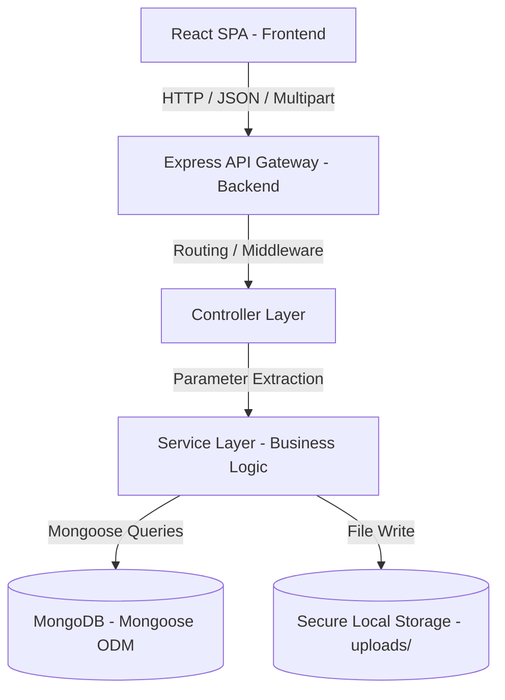
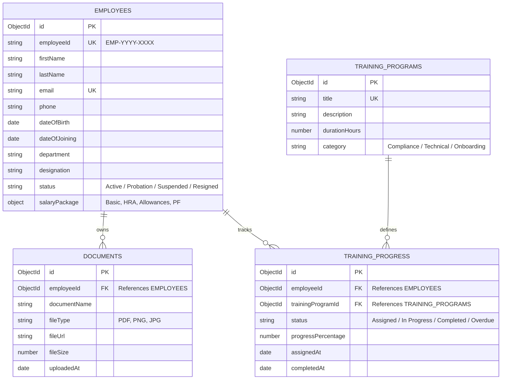

# System Architecture - Enterprise HR Automation Platform

This document describes the complete modular architecture, data relationships, request flows, API contracts, and upload patterns for the Enterprise HR Automation Platform.

---

## Architecture Overview

The platform uses a decoupled client-server architecture. The frontend operates as a single page application (SPA) powered by React and Vite, while the backend serves as a stateless RESTful JSON API using Node.js, Express, and MongoDB.



---

## Frontend Architecture

The frontend is structured around a highly modular, container-presenter, and custom-hook architecture.

* **Routing (React Router DOM v6):** Handles client-side paths: `/dashboard`, `/employees`, `/employees/create`, `/employees/:id`, `/employees/:id/edit`, `/documents`, `/documents/upload`, `/documents/:id`, `/offers`, `/offers/create`, `/offers/:id`, `/offers/:id/edit`, `/salary`, `/salary/:empId`, `/training`, `/training/create`, `/training/:id`, `/reports`, `/reports/analytics`, `/reports/generator`, `/reports/departments`, `/reports/compliance`, `/settings`.
* **Services Layer (`src/services/`):** `employeeService.js`, `documentService.js`, `offerService.js`, `salaryService.js`, `trainingService.js`, `analyticsService.js`, `reportService.js` (Async service methods ready for Analytics & Export API replacement).
* **State Management Layer (`src/context/`):** `EmployeeContext.jsx`, `DocumentContext.jsx`, `OfferContext.jsx`, `SalaryContext.jsx`, `TrainingContext.jsx`, `AnalyticsContext.jsx` (Single Source of Truth aggregating data from all module contexts live).
* **Custom Hooks Layer (`src/hooks/`):** `useEmployees.js`, `useDocuments.js`, `useOffers.js`, `useSalary.js`, `useTraining.js`, `useAnalytics.js` (Custom hooks exposing domain state & handlers safely to UI).
* **Domain Utilities Layer (`src/utils/`):** `employeeHelpers.js`, `documentHelpers.js`, `offerHelpers.js`, `salaryHelpers.js`, `trainingHelpers.js`, `analyticsHelpers.js`, `analyticsSelectors.js` (growth math, compliance scoring, offer acceptance calculations, memoized context selectors, AI readiness hooks), `dateValidation.js`.
* **Pages Layer:** `Dashboard`, `Employees`, `EmployeeCreate`, `EmployeeDetail`, `EmployeeEdit`, `Documents`, `DocumentUpload`, `DocumentDetail`, `Offers`, `OfferCreate`, `OfferEdit`, `OfferDetail`, `Salary`, `SalaryDetail`, `Training`, `TrainingCreate`, `TrainingDetail`, `ReportCenter` (Library & Saved Reports), `AnalyticsDashboard` (Boardroom C-Suite Dashboard), `ReportGenerator` (7-step Builder), `DepartmentAnalyticsPage`, `ComplianceDashboardPage`, `Settings`, `Login`.
* **Domain Components (`components/analytics/`, `components/training/`, `components/salary/`, `components/offer/`, `components/document/`, `components/employee/`):** `KPICard`, `ExecutiveSummary`, `InsightCard`, `DepartmentCard`, `ReportTable`, `ReportBuilder`, `AnalyticsFilters`, `ExportDialog`, `ComplianceWidget`, `TrainingStatusBadge`, `TrainingStatsCards`, `TrainingFilters`, `TrainingTable`, `TrainingProgressBar`, `TrainingCalendar`, `TrainingAssignmentModal`, `CertificateCard`, `ComplianceCard`, `TrainingWizardModal`, `SalaryBadge`, `SalaryStatsCards`, `SalaryFilters`, `SalaryTable`, `SalaryBreakdownCard`, `PFSummaryCard`, `SalaryRevisionTimeline`, `SalaryCompareModal`, `SalaryRevisionModal`, `SalaryAnalyticsCards`, `OfferStatusBadge`, `OfferStatsCards`, `OfferFilters`, `OfferTable`, `OfferPreview`, `OfferPreviewModal`, `OfferAuditTrailModal`, `OfferNegotiationModal`, `OfferVersionCompareModal`, `VerificationBadge`, `ExpiryBadge`, `DocumentStatsCards`, `DocumentFilters`, `DocumentTable`, `DocumentUploadQueue`, `DocumentPreviewModal`, `Modal`, `EmployeeAvatar`, `EmployeeStatusBadge`, `DepartmentBadge`, `EmployeeFilters`, `EmployeeTable`, `EmployeeCard`, `DocumentUploader`, `ProfileHeader`, `EmployeeTimeline`, `EmployeeFormSteps`, `EmployeeForm`.
* **Shared Primitive Components:** `Button`, `Input`, `Select`, `SearchBar`, `Modal`, `Table`, `Card`, `PageHeader`, `Toast`.
* **Mock Seed Data Layer:** Centralized in `frontend/src/mock/employees.js`, `frontend/src/mock/documents.js`, `frontend/src/mock/offers.js`, `frontend/src/mock/salary.js`, `frontend/src/mock/training.js`, `frontend/src/mock/analytics.js`.


---

## Backend Architecture

The backend implements a clean, layered architectural pattern, separating routing, parameter validation, custom middleware, business controllers, services, and the database model layer.

* **Server Entry Point (`server.js`):** Starts the HTTP server, registers database connections, handles initial startup configurations, and logs bootstrap operations.
* **App Setup (`app.js`):** Integrates global middlewares (Morgan, CORS, Express JSON parser), configures standard security parameters, and binds the primary routing gateway.
* **Routing Layer (`/routes`):** Maps REST endpoints to specific controllers. Applies route-specific validation and authentication middleware.
* **Controller Layer (`/controllers`):** Captures incoming requests (`req.body`, `req.params`, `req.query`). Handles validation checks, invokes services, and sends back HTTP responses with standard status codes.
* **Service Layer (`/services`):** Encapsulates the entire business logic. Calculations (PF computation, salary packages), ID generation patterns, file system interfaces, and database writes occur here. Controllers MUST NOT query database models directly; they must delegate to services.
* **Data Layer (`/models`):** Uses Mongoose schemas to interface with MongoDB. Defines rules, data validation limits, pre-save hooks, and relationships.

---

## Request Flow

All requests flow through a strict, multi-tiered pipeline:

```text
[HTTP Request]
       │
       ▼
[Express Router]
       │
       ▼
[Global Middleware] ────────► (Cors, Morgan Logger, JSON Parser)
       │
       ▼
[Route Middleware] ─────────► (JWT Auth, Role Gate, Upload Check, Validation Schema)
       │
       ▼
[Controller] ───────────────► (Extract body/params, handle light schema parsing)
       │
       ▼
[Service Layer] ────────────► (Runs computations, constructs data payloads)
       │
       ▼
[Mongoose ODM]
       │
       ▼
  [MongoDB]
```

---

## Database Collections & Relationships

The database is built on top of MongoDB using Mongoose. The HR Module contains four core collections:



### Collection Schemas Detailed

#### 1. Employees (`employees`)
* `employeeId`: String, unique, indexed. Auto-generated pattern: `EMP-YYYY-XXXX`.
* `firstName`, `lastName`, `email` (unique, indexed), `phone`, `dateOfBirth`, `dateOfJoining`, `department`, `designation`.
* `status`: String enum (`Active`, `Probation`, `Suspended`, `Resigned`), defaults to `Probation`.
* `salaryPackage`: Nested Object:
  * `basicSalary`: Number.
  * `hra`: Number.
  * `allowances`: Number.
  * `pfContribution`: Number (calculated automatically).
  * `totalCTC`: Number.

#### 2. Documents (`documents`)
* `employeeId`: Schema.Types.ObjectId referencing `employees`.
* `documentName`: String.
* `fileType`: String.
* `fileUrl`: String (storage path inside system directories).
* `fileSize`: Number (in bytes).
* `uploadedAt`: Date, defaults to `Date.now`.

#### 3. Training Programs (`training_programs`)
* `title`: String, unique.
* `description`: String.
* `durationHours`: Number.
* `category`: String enum (`Compliance`, `Technical`, `Onboarding`).

#### 4. Training Progress (`training_progress`)
* `employeeId`: Schema.Types.ObjectId referencing `employees`.
* `trainingProgramId`: Schema.Types.ObjectId referencing `training_programs`.
* `status`: String enum (`Assigned`, `In_Progress`, `Completed`, `Overdue`).
* `progressPercentage`: Number, defaults to 0.
* `assignedAt`: Date, defaults to `Date.now`.
* `completedAt`: Date.

---

## File Upload Flow (Multer Integration)

The platform supports secure document uploads using Multer on the backend. Files are stored locally under `backend/uploads/` and tracked in the database.

```text
[Frontend: Form Data] ─(file + employeeId)─► [Backend: upload.single('file') Middleware]
                                                             │
                                                             ▼
                                                [File Validation Engine]
                                                ├── Size Limit (Max 5MB)
                                                └── MIME-Type Filter (PDF, JPG, PNG only)
                                                             │
                                                             ▼
                                                [Storage: backend/uploads/]
                                                └── Rename: date-originalName.ext
                                                             │
                                                             ▼
                                                [Controller Layer]
                                                └── Receives 'req.file' & 'req.body'
                                                             │
                                                             ▼
                                                [Document Service]
                                                └── DB Write: Creates entry in documents
                                                             │
                                                             ▼
                                                [JSON Response Payload]
```

---

## API Structure & Endpoints

All routes are prefixed with `/api/v1`.

### Employees Endpoint (`/api/v1/employees`)
* **GET `/`**: Fetch all employees (supports pagination, filtering by department/status, and search).
* **GET `/:id`**: Fetch a single employee details.
* **POST `/`**: Create a new employee profile. Auto-generates ID, computes basic PF, and stores fields.
* **PUT `/:id`**: Update employee attributes.
* **DELETE `/:id`**: Soft-delete/deactivate employee profile.

### Documents Endpoint (`/api/v1/documents`)
* **POST `/upload`**: Accepts multipart/form-data. Stores file and creates link entry.
* **GET `/employee/:employeeId`**: Retrieve list of documents mapped to a specific employee.
* **GET `/:id/download`**: Streams the file binary down to client.
* **DELETE `/:id`**: Removes file metadata from DB and deletes local file from storage.

### Trainings Endpoint (`/api/v1/trainings`)
* **GET `/programs`**: List all training programs.
* **POST `/programs`**: Create a new training program.
* **POST `/assign`**: Link a training program to an employee (creates tracking entry).
* **GET `/progress/:employeeId`**: Retrieve completion status for all programs assigned to an employee.
* **PUT `/progress/:id`**: Update completion percentage or status.

---

## Future Scalability

To support expansion beyond the core HR Module:
1. **Database Indexing:** Ensure indices are placed on queries filtering by `employeeId`, `department`, and `status`.
2. **Horizontal Scaling Ready:** All backend components are stateless. Session management uses JWT tokens, allowing multiple backend node processes to scale behind a Load Balancer.
3. **Database Decoupling:** In future growth, collections like `documents` can easily be shifted to an AWS S3/Cloud Storage system by updating the `fileUrl` service handler without editing controllers or models.
