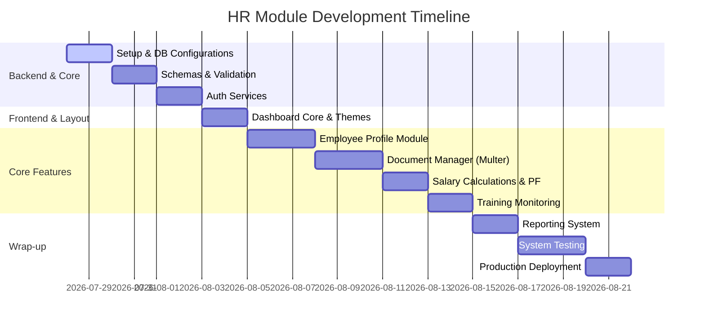

# Development Roadmap - Enterprise HR Automation Platform

This document describes the step-by-step development roadmap for the HR Module of the Enterprise HR Automation Platform. The roadmap is divided into 11 logical phases, listing essential deliverables, activities, and validation metrics for each stage.

---

## Roadmap Overview

---

## Phase 1: Project Setup & Base Architecture

Establish the initial directory structure, environment variables, configuration helpers, and runtime dependencies.

* **Backend Tasks:**
  * Initialize Node.js environment (`npm init`).
  * Setup `app.js` with Morgan, Cors, and Express JSON parser middleware.
  * Install standard dependencies (express, mongoose, dotenv, cors, morgan, bcrypt, multer).
  * Setup `.env.example` with standard ports and DB configs.
* **Frontend Tasks:**
  * Setup React 18 application with Vite.
  * Configure Tailwind CSS config file using the colors and typography defined in the [UI Design System](file:///d:/HR%20GROUP/ui-design-system.md).
  * Configure Axios API client template mapping base URL.
* **Deliverables:**
  * Clean running servers locally.
  * Verified configuration linkages.

---

## Phase 2: Database Configuration & Schemas

Create the model structures and constraints within MongoDB via Mongoose.

* **Tasks:**
  * Establish database connector helper inside `backend/src/config/db.js`.
  * Code Mongoose schema files inside `backend/src/models/`:
    * `employeeModel.js`
    * `documentModel.js`
    * `trainingProgramModel.js`
    * `trainingProgressModel.js`
  * Add schema validation rules, indices, and type constraints.
* **Deliverables:**
  * Four Mongoose model code modules.
  * Successful connection check scripts.

---

## Phase 3: Authentication & Middleware Setup

Add custom request wrappers and secure token validation logic.

* **Tasks:**
  * Build encryption/hashing utility services utilizing `bcrypt`.
  * Set up JWT signing and verification services.
  * Implement route-level middlewares:
    * `authMiddleware.js`: Verifies JWT headers and appends user payload.
    * `roleMiddleware.js`: Restricts routes by checking authorization attributes.
* **Deliverables:**
  * Safe auth routing logic.
  * Integration tests verifying route blocking (HTTP 401/403).

---

## Phase 4: HR Dashboard Core & Layout Integration

Set up the visual shell of the frontend and baseline UI components.

* **Tasks:**
  * Implement global router inside `frontend/src/routes/`.
  * Build layout containers (`DashboardLayout`, `Sidebar`, `Navbar`).
  * Integrate Dark Mode toggler hook mapping state to CSS classes.
  * Code reusable UI primitives: `Button.jsx`, `Input.jsx`, `Table.jsx`, `Card.jsx`.
* **Deliverables:**
  * Responsive sidebar navigation shell working on desktop and mobile.
  * CSS variables working in both Light and Dark mode.

---

## Phase 5: Employee Profile Creation & Management (Frontend UI Complete)

Implement profile creation, multi-step form wizard, employee detail tabs, and auto-generation preview of Employee IDs.

* **Backend Tasks (Phase 2+):**
  * Code Mongoose pre-save hook for auto-generating sequential IDs: `EMP-YYYY-[4-digit counter]`.
  * Implement creation services inside `employeeService.js`.
  * Build controllers (`employeeController.js`) and routes mapping.
* **Frontend Tasks (COMPLETE):**
  * Established enterprise 5-layer architecture (**Seed Data → Service Layer → Context State → Custom Hook → UI Layer**).
  * Isolated seed data inside `frontend/src/mock/employees.js` (Pure seed arrays ONLY; zero functions or logic).
  * Extracted reusable business utilities into `frontend/src/utils/employeeHelpers.js` (`generateEmployeeId`, `calculateDepartmentCounts`, `calculateEmployeeStats`, `buildActivityObject`, `generateAvatarInitials`).
  * Created service abstraction layer inside `frontend/src/services/employeeService.js` returning async Promises ready for 1-to-1 Axios REST API replacement.
  * Created Single Source of Truth `frontend/src/context/EmployeeContext.jsx` holding roster state, statistics, activity log, filters, and 4s toast.
  * Created custom hook `frontend/src/hooks/useEmployees.js` for clean UI component access.
  * Built 5-step form wizard (`EmployeeForm.jsx`, `EmployeeFormSteps.jsx`) with HR date validation rules (DOB 18-65 y/o, Joining Date >= Today & <= Today+365) and Post-Creation Success View with 4 action routes.
  * Built Employee List page (`Employees.jsx`), Employee Detail page (`EmployeeDetail.jsx`), and Employee Edit page (`EmployeeEdit.jsx`).
* **Deliverables:**
  * Complete 5-layer Employee Management Architecture ready for seamless Phase 2 backend REST API integration.
  * Instant multi-page synchronization across Dashboard, Roster, Search, Stats, and Activity Log.

---

## Phase 6: Document Management System (Frontend UI & Architecture COMPLETE)

Integrate enterprise document management, verification workflows, and multi-file drag-and-drop upload.

* **Backend Tasks (Phase 2+):**
  * Code Multer configuration in `backend/src/config/multer.js` implementing size limiters (5MB) and type validators.
  * Implement services to write document records to MongoDB.
  * Write controllers for document upload, download streams, and delete requests.
* **Frontend Tasks (COMPLETE):**
  * Built 5-layer architecture (**Seed Data → Domain Helpers → Service Layer → Context State → Custom Hook → UI Layer**).
  * Built Documents Dashboard (`Documents.jsx`) with 6 summary metric cards, quick actions strip, filters, document table, and fullscreen preview modal.
  * Built Multi-File Drag & Drop Upload Page (`DocumentUpload.jsx`, `DocumentUploadQueue.jsx`) with format validation & 5MB size checks.
  * Built Document Detail & Verification Page (`DocumentDetail.jsx`) with metadata grid, preview window, HR Verification workflow buttons (Approve, Reject with Reason, Request Update), version history timeline, and expiry badges.
* **Deliverables:**
  * Complete 5-layer Employee Document Management System ready for seamless Multer / MongoDB / S3 backend integration.

## Phase 7: Offer Packet Management System (Frontend UI & Architecture COMPLETE)

Integrate enterprise offer letter generation, compensation calculation, preset templates, approval workflows, version history, printable A4 preview, and immutable audit logging.

* **Backend Tasks (Phase 2+):**
  * Code PDFKit / Puppeteer PDF generation service for server-side offer letter exports.
  * Implement Nodemailer service for candidate offer email dispatch.
  * Code MongoDB schema and controllers for offer packets, templates, and digital signatures.
* **Frontend Tasks (COMPLETE):**
  * Built 5-layer architecture (**Seed Data → Domain Helpers → Service Layer → Context State → Custom Hook → UI Layer**).
  * Built Offers Dashboard (`Offers.jsx`) with 6 summary metric cards, quick actions strip, filters, roster table, and fullscreen preview modal.
  * Built 6-Step Offer Wizard (`OfferCreate.jsx`) with compensation calculator (Monthly Gross, Annual Base, CTC), preset template loader (`Full-Time`, `Internship`, `Contract`, `Remote`), benefits selector, terms validator, and A4 letterhead preview.
  * Built Post-Generation Success View with 4 action routes.
  * Built Offer Detail & Workflow Page (`OfferDetail.jsx`) with HR Approval Workflow buttons (Approve, Reject with Reason, Mark Accepted, Decline), version timeline, and immutable audit trail modal.
  * Created AI extension hooks in `offerHelpers.js` (`validateOfferAI`, `salaryRecommendationAI`, `marketSalaryComparisonAI`, `clauseRecommendationAI`).
## Phase 8: Salary Summary & PF Management System (Frontend UI & Architecture COMPLETE)

Integrate enterprise salary structure, earnings vs deductions breakdown, statutory Provident Fund (PF) calculations, department-wise CTC analytics, salary revision versioning, and side-by-side revision comparison.

* **Backend Tasks (Phase 2+):**
  * Code Payroll API endpoints for salary records, PF contribution statements, and tax calculation engines.
  * Implement MongoDB schema for employee compensation records and historical revisions.
* **Frontend Tasks (COMPLETE):**
  * Built 5-layer architecture (**Config & Seed Data → Domain Helpers → Service Layer → Context State → Custom Hook → UI Layer**).
  * Created `payrollConstants.js` for centralized configurable payroll parameters (EPFO 12% employee/employer match, ₹200/mo Professional Tax, 5% mock Income Tax).
  * Built Salary Dashboard (`Salary.jsx`) with 6 summary metric cards (Total Salaried, Avg CTC, Highest CTC, Lowest CTC, Monthly Payroll, Total PF), department-wise CTC distribution analytics cards (`SalaryAnalyticsCards.jsx`), filters, and roster table.
  * Built Employee Salary Details Page (`SalaryDetail.jsx`) with earnings vs deductions breakdown (`SalaryBreakdownCard.jsx`), EPFO PF Summary card (`PFSummaryCard.jsx`), revision timeline (`SalaryRevisionTimeline.jsx`), Revise Salary modal (`SalaryRevisionModal.jsx`), and side-by-side revision comparison modal (`SalaryCompareModal.jsx`).
  * Created AI extension hooks in `salaryHelpers.js` (`payrollProcessingHook`, `payslipGenerationHook`, `taxCalculatorHook`, `aiSalaryBenchmarkHook`).
* **Deliverables:**
  * Complete 5-layer Salary Summary & PF Management System ready for Express/MongoDB/Payroll API backend integration.

## Phase 9: Mandatory Training & Training Monitoring System (Frontend UI & Architecture COMPLETE)

Build a complete enterprise Training Management System that enables HR to create training programs, assign mandatory training, track progress, monitor compliance, issue verified certificates, and view interactive training calendars.

* **Backend Tasks (Phase 2+):**
  * Code Learning API endpoints for course catalogs, assignment progress tracking, and certificate verification.
  * Implement MongoDB schemas for training programs, employee assignments, and certificates.
* **Frontend Tasks (COMPLETE):**
  * Built 5-layer architecture (**Config & Seed Data → Domain Helpers → Service Layer → Context State → Custom Hook → UI Layer**).
  * Created `trainingConstants.js` for centralized configurable rules (Categories, Statuses, Modes, Priority levels, Recurrence options). Zero hardcoding.
  * Built Training Dashboard (`Training.jsx`) featuring 7 summary metric cards, catalog roster table, interactive monthly training calendar tab (`TrainingCalendar.jsx`), and organization compliance monitor tab (`ComplianceCard.jsx`).
  * Built 5-Step Multi-Step Wizard Page (`TrainingCreate.jsx`) & Modal (`TrainingWizardModal.jsx`) for program creation.
  * Built Training Detail Page (`TrainingDetail.jsx`) featuring learning objectives, assigned roster with progress bars (`TrainingProgressBar.jsx`), single-click 100% completion trigger, and target assignment modal (`TrainingAssignmentModal.jsx`).
  * Created AI & SCORM extension hooks in `trainingHelpers.js` (`aiRecommendedTrainingHook`, `skillGapAnalysisHook`, `aiCompliancePredictionHook`, `scormPackageHook`, `quizEngineHook`).
* **Deliverables:**
  * Complete 5-layer Mandatory Training & Monitoring System ready for Express/MongoDB/Learning API backend integration.

---

## Phase 8: Training Monitor & Assignment

Implement assignment trackers and course status management.

* **Backend Tasks:**
  * Code routing interfaces to create training courses.
  * Implement batch assignment service mapping training models to employees.
  * Create training progress update controllers.
* **Frontend Tasks:**
  * Build Training Manager view inside dashboard.
  * Design visual progress indicators (radial status rings) indicating employee task status.
* **Deliverables:**
  * Course assignment forms.
  * Real-time progress updates syncing to database entries.

---

## Phase 10: Executive HR Analytics & Report Generation Center (Frontend UI & Architecture COMPLETE)

Build a complete C-suite HR Analytics Dashboard and Report Generation Center aggregating live data across all 5 HR modules (Employees, Documents, Offers, Salary, Training).

* **Backend Tasks (Phase 2+):**
  * Code Analytics API endpoints for global metrics, department distributions, and executive trend indicators.
  * Implement server-side export services (PDFKit for PDF reports, ExcelJS for CSV/XLSX exports).
* **Frontend Tasks (COMPLETE):**
  * Built 5-layer architecture (**Config & Templates → Domain Helpers & Selectors → Service Layer → Context State → Custom Hook → UI Layer**).
  * Created `reportTemplates.js` for built-in report templates, categories, and export format definitions. Zero hardcoding.
  * Built Boardroom HR Analytics Dashboard (`AnalyticsDashboard.jsx`) featuring C-suite banner (`ExecutiveSummary.jsx`), 6 KPI cards with trend indicators & single-click drill-down navigation (`KPICard.jsx`), department performance grid (`DepartmentCard.jsx`), and executive insights (`InsightCard.jsx`).
  * Built Report Center & Library Page (`ReportCenter.jsx`) featuring categorized template filters, search bar, run report triggers, and generated report archive.
  * Built 7-step Interactive Report Builder Page (`ReportGenerator.jsx` & `ReportBuilder.jsx`).
  * Built Department Analytics Page (`DepartmentAnalyticsPage.jsx`) & Compliance Dashboard Page (`ComplianceDashboardPage.jsx`).
  * Created pure memoized selectors (`analyticsSelectors.js`) aggregating live data across all module contexts.
  * Created AI readiness hooks in `analyticsHelpers.js` (`aiWorkforceForecastingHook`, `attritionPredictionHook`, `hiringRecommendationsHook`, `aiReportGenerationHook`).
* **Deliverables:**
  * Complete 5-layer Executive HR Analytics & Report Generation System ready for Express/MongoDB/Analytics API backend integration.

---

## Phase 10: System Integration Testing

Audit structural stability, validation compliance, and API responsiveness.

* **Tasks:**
  * Code integration tests for routing controllers using testing suites.
  * Perform boundary condition checks (e.g., uploading corrupted files, negative salaries, duplicate email entries).
  * Perform manual walkthrough checks ensuring design system classes are strictly reused.
* **Deliverables:**
  * Clean testing reports.
  * Verified UI rendering across all responsive viewports.

---

## Phase 11: Production Deployment

Package and deploy the production-ready application.

* **Tasks:**
  * Secure backend config: disable morgan verbose logging, bind process manager rules (PM2).
  * Build frontend assets using Vite (`npm run build`).
  * Verify CORS setups restrict queries to production domains.
  * Final memory update (`memory.md` task completion sync).
* **Deliverables:**
  * Running system in cloud environments.
  * Static Vite assets compiled and served.
